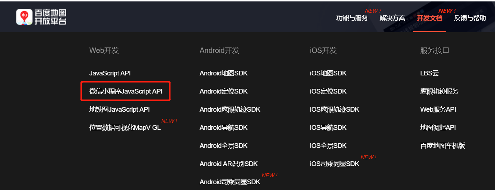
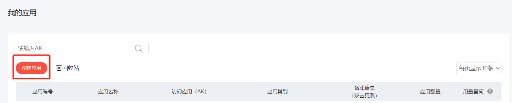
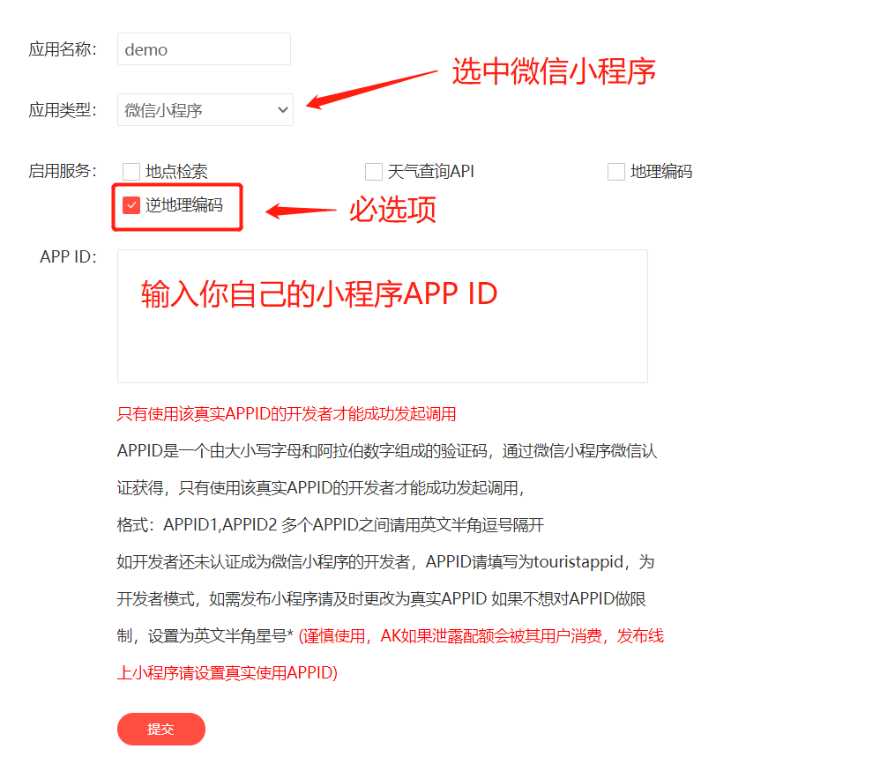
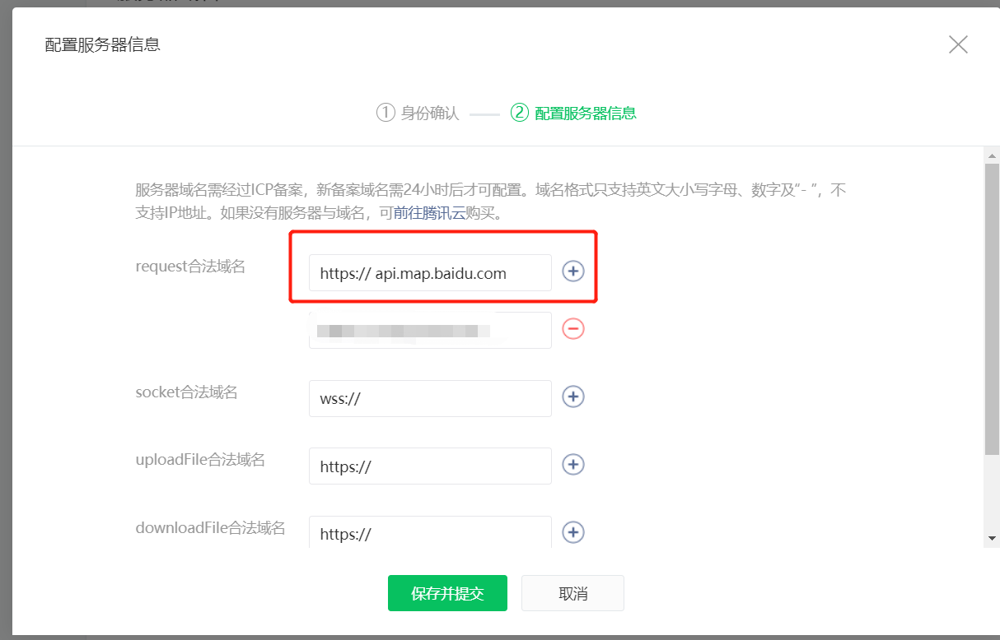

## 如何在微信小程序中获取用户的地理位置，并显示相应的城市街道名称？

微信小程序的[wx.geLocation()](https://developers.weixin.qq.com/miniprogram/dev/api/location/wx.getLocation.html)方法可以获取当前的地理位置，但拿到的是经纬度，不包含地名，所以需要引入第三方插件将经纬度转成地名，一般选用高德地图或百度地图，本次使用的是百度地图。

### 一、首先，拿到使用百度地图 API 的资格

1. 打开[百度地图开发平台](http://lbsyun.baidu.com/)，按照开发文档中，微信小程序 Javascript API 文档指引，先[申请密钥](http://lbsyun.baidu.com/apiconsole/key?application=key#/home)
   

2. 创建应用
   
   
   提交后将获取到密钥 AK

3. 拼接百度地图线上转换地址

   这里要说明一下，因为我们这次功能很简单（只把经纬度转成地址名称）+ 小程序发布时对大小有限制，所以我不使用百度地图提供的压缩包，而是选用线上转换地址。地址如下：

   ```
   https://api.map.baidu.com/reverse_geocoding/v3/?ak=[密钥]&output=json&coordtype=wgs84ll&location=[latitude],[longitude]

   // []中的内容替换成真实信息
   ```

### 二、然后，把百度地图线上转换地址添加到小程序的 request 合法域名中

开发——开发设置——服务器域名



### 三、最后，写代码

```
    let that = this;

    //判断系统定位有没有打开和微信是否被授权
    let sInfo = wx.getSystemInfoSync();

    // 使用wx.getLocation()获取当前用户的经纬度
    wx.getLocation({
      type: 'wgs84',
      success(result) {
        console.log(result.longitude, result.latitude)

        // 使用百度地图API将经纬度转换成详细的地址名称
        wx.request({
            url: 'https://api.map.baidu.com/reverse_geocoding/v3/?ak=[密钥]&output=json&coordtype=wgs84ll&location=' + result.latitude + ',' + result.longitude,
            data:{},
            header:{
                'Content-Type':'application/json'
            },
            success: function(res){
                if(res && res.data) {
                    let city = res.data.result.addressComponent.city;
                    that.setData({
                        city:city.indexOf('市') > -1 ? city.substr(0, city.indexOf('市')) : city
                    });
                    console.log(city);
                }else {
                    that.setData({
                        city:''
                    });
                }
            }
        })
      },
      fail(err) {
        console.log(err);
      }
    })

```


